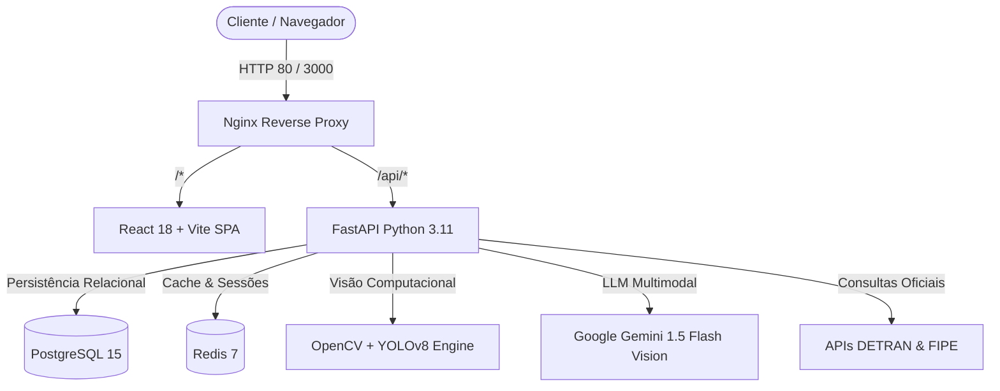
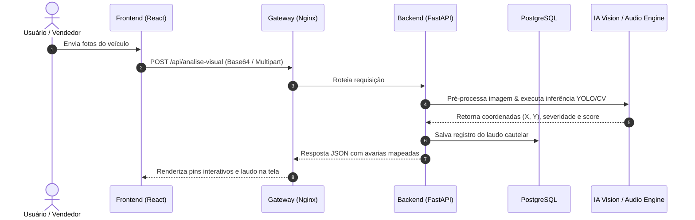

# Arquitetura de Software — Automatch™

Este documento descreve a arquitetura de software, componentes, fluxo de dados, modelo de persistência e decisões técnicas que fundamentam a plataforma **Automatch**.

---

## 1. Contexto Técnico

A solução atende ao ecossistema de marketplace automotivo com foco em auditoria pericial e transparência. Seus principais desafios operacionais são:
- **Alta responsividade na análise visual**: Processamento de imagens em alta definição sem bloqueio da interface do usuário.
- **Isolamento e desacoplamento**: Separação clara entre a camada de apresentação, serviços de negócio, orquestração pericial e persistência de dados.
- **Segurança de transações e dados**: Criptografia de senhas, sessões autenticadas sem estado (*stateless JWT*) e mitigação de acessos não autorizados.

---

## 2. Componentes do Sistema

| Componente | Tecnologia | Responsabilidade Principal |
| :--- | :--- | :--- |
| **API Gateway** | Nginx Alpine | Ponto de entrada unificado da aplicação, terminação HTTP, proxy reverso, compressão Gzip e roteamento de tráfego `/` e `/api/*`. |
| **Frontend (SPA)** | React 18, Vite, TailwindCSS | Interface do usuário responsiva, animações Framer Motion, visualizador 360° interativo e processamento de som Web Audio API. |
| **Backend API** | FastAPI / Python 3.11 | API RESTful assíncrona, validação de esquemas com Pydantic v2, autenticação JWT e orquestração de microsserviços. |
| **Motor de Visão Computacional** | OpenCV + YOLOv8 + PIL | Pré-processamento e compressão de fotos (*LANCZOS*), detecção de classes automotivas e mapeamento de avarias na lataria. |
| **Motor de Diagnóstico Acústico** | Python DSP + FFT / Web Audio | Análise espectral de frequências sonoras da marcha lenta e simulação de áudio mecânico. |
| **Banco de Dados Relacional** | PostgreSQL 15 | Armazenamento de dados persistentes de veículos, lojas, laudos periciais, tokens de recuperação e usuários com SQLAlchemy ORM. |
| **Cache & Mensageria** | Redis 7 Alpine | Cache em memória de consultas veiculares de placas, cotas FIPE e controle de sessões. |
| **Agendador em Background** | APScheduler | Monitoramento periódico assíncrono (a cada 60 segundos) de débitos da Watchlist DETRAN. |
| **Gerador de Dossiê & QR Code** | ReportLab + qrcode + Pillow | Emissão de laudo pericial oficial em PDF vetorial A4 com QR Code dinâmico apontando para `/validar/:protocolo`. |
| **Módulo de Recuperação (OTP)** | PBKDF2 + Hash SHA-256 + Rate Limiting | Emissão de OTP de 6 dígitos com expiração de 15 minutos e proteção contra brute-force (3 req/hora). |

---

## 3. Integrações Externas

1. **Tabela FIPE (Fundação Instituto de Pesquisas Econômicas)**:
   - *Finalidade*: Consulta em tempo real do valor médio oficial de mercado por código FIPE e ano modelo.
   - *Resiliência*: Fallback inteligente para dados históricos em caso de indisponibilidade momentânea da API externa.
2. **DETRAN / SENATRAN (Bases Governamentais)**:
   - *Finalidade*: Checagem cadastral de débitos (IPVA, licenciamento e multas) e auditoria de restrições administrativas/judiciais (RENAJUD).
3. **Google Gemini Multimodal API (v1beta)**:
   - *Finalidade*: Laudo pericial visual descritivo, auditoria inteligente de documentos PDF e assistente virtual consultivo especializado no veículo via RAG.
4. **Agregadores Automotivos B2B Homologados (Webmotors, OLX Autos e AutoCerto DMS)**:
   - *Finalidade*: Sincronização automatizada de anúncios nos 3 portais oficiais e exportação de Feed XML padronizado (`/api/integrations/autocerto/feed.xml`).

---

## 4. Fluxo e Gestão de Dados

- **Privacidade & LGPD**: Dados de contato de compradores e placas de veículos são transmitidos sob canal criptografado HTTPS/TLS e nunca expostos publicamente em feeds externos sem consentimento.

---

## 5. Decisões Técnicas (ADRs Sintetizadas)

- **ADR-01: Arquitetura em Microsserviços Conteinerizados via Docker Compose**:
  - *Decisão*: Isolar banco de dados, cache, backend, frontend e gateway em contêineres dedicados.
  - *Justificativa*: Facilidade de implantação, reprodutibilidade em qualquer ambiente e independência de versões.
- **ADR-02: Autenticação Stateless com JWT e Criptografia PBKDF2-HMAC-SHA256**:
  - *Decisão*: Utilizar tokens JWT assinados via HMAC-SHA256 e salts aleatórios para senhas.
  - *Justificativa*: Elimina necessidade de armazenar estado de sessão no servidor e atende aos mais rigorosos padrões de cibersegurança.
- **ADR-03: Motor Híbrido de Visão Computacional (Edge/Local + Cloud Fallback)**:
  - *Decisão*: Suportar inferência com YOLOv8/OpenCV local e Google Gemini Cloud.
  - *Justificativa*: Garante que a perícia visual funcione mesmo em ambientes sem conectividade com APIs de terceiros.
- **ADR-04: Emissão de Dossiês em PDF Vetorial A4 com ReportLab e QR Code**:
  - *Decisão*: Abandonar renderização HTML/rasterizada e implementar geração vetorial pura em ReportLab com QR Code de 300 DPI.
  - *Justificativa*: Permite fidelidade gráfica impressa, texto selecionável, conformidade com padrões de perícia judicial e verificação instantânea via scanner.
- **ADR-05: Autenticação Defensiva com Recuperação de Senha por OTP e Rate Limiting**:
  - *Decisão*: Implementar OTP de 6 dígitos persistido com hash SHA-256 (`otp:email`), validade de 15 minutos e bloqueio após 3 tentativas/hora.
  - *Justificativa*: Protege os usuários contra invasões e sequestro de contas sem onerar a experiência de uso.
- **ADR-06: Paginação Orientada a Banco de Dados com Envelope Padronizado**:
  - *Decisão*: Adotar paginação server-side via SQL `OFFSET`/`LIMIT` com envelope `{ items, total, page, pages, limit }` e busca debounced.
  - *Justificativa*: Elimina overhead de tráfego de rede e consumo excessivo de memória em clientes móveis, suportando catálogos de grande porte.

---

## 6. Riscos Técnicos e Estratégias de Mitigação

| Risco Identificado | Impacto | Estratégia de Mitigação |
| :--- | :---: | :--- |
| **Latência no upload de imagens pesadas** | Médio | Pré-compressão com algoritmo *LANCZOS* reduzindo fotos para 1024x1024 antes da transmissão. |
| **Indisponibilidade de APIs governamentais (DETRAN/FIPE)** | Alto | Cache persistente em Redis com expiração configurável e dados simulados de contingência. |
| **Sobrecarga em consultas concorrentes de estoque** | Médio | Pool assíncrono de conexões com SQLAlchemy e indexação por chaves primárias UUID e códigos FIPE. |
