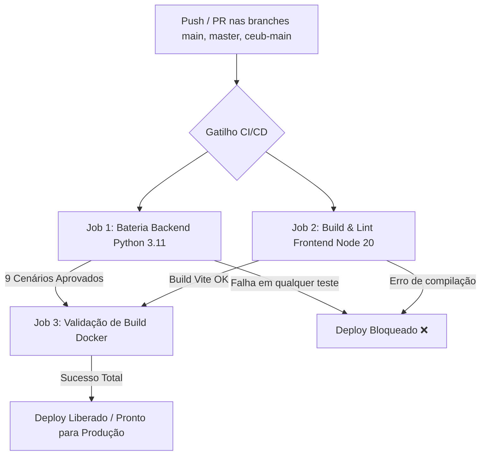

# Relatório de Auditoria de Processo e CI/CD — Automatch

**Data da Auditoria:** 25 de Setembro de 2026  
**Foco:** Inspeção de Processo, Qualidade de Código, Pipeline de CI/CD e Governança Técnica  
**Responsável Técnico:** Equipe de Engenharia / Auditoria de Sistemas

---

## 1. Diagnóstico do Processo Anterior: Por que as Regressões Ocorriam?

A auditoria técnica identificou que as sucessivas rodadas de correções paliativas e as regressões contínuas (como a tripla falha do Comparador Multidimensional e a remoção acidental de botões de IA) eram sintomas diretos de **gargalos no pipeline de integração e entrega contínua (CI/CD)**:

### 1.1. Falhas Críticas Encontradas no Workflow Anterior
1. **Testes Desativados no Pipeline:**
   - O arquivo `.github/workflows/ci.yml` continha linhas de teste expressamente comentadas:
     ```yaml
     - name: Rodar testes do Backend
       run: |
         echo "Aqui rodariam os testes Python (ex: pytest)"
         # python -m pytest
     ```
   - Código quebrado no backend era integrado sem qualquer verificação automática prévia.
2. **Gatilhos Incompletos de Branch:**
   - O CI só era disparado em eventos de `pull_request`. Pushes diretos para `main` ou para a branch acadêmica/homologação `ceub-main` contornavam o workflow por completo.
3. **Deploy Contínuo sem Portão de Qualidade (*Quality Gate*):**
   - O workflow `.github/workflows/static.yml` compilava e publicava o frontend no GitHub Pages sem depender do sucesso dos testes unitários ou de integração do backend.
4. **Ausência de Teste de Resiliência de Interface:**
   - O frontend não possuía um `ErrorBoundary` global configurado no nível de roteamento. Qualquer erro pontual em um modal ou hook de dados desmontava a árvore React inteira, gerando a "tela branca" sem logs para o usuário final.

---

## 2. Nova Arquitetura de CI/CD Implementada

O arquivo `.github/workflows/ci.yml` foi completamente refatorado e ativado como um **Quality Gate rigoroso**:



### 2.1. Detalhamento dos Jobs Automatizados

1. **Job 1: Bateria de Testes Backend (`testar-backend`)**
   - Ambiente: `ubuntu-latest`, Python 3.11 com cache de dependências (`pip`).
   - Execução: `python -m unittest test_audit_full_battery.py` com banco SQLite isolado.
   - Escopo: 9 cenários de ponta a ponta (B2B, Scanner IA, DETRAN/FIPE, Chatbot Multi-Turn, Comparador, Hub Multicanal, Radar de Oportunidades, Calculadora TCO e SLA de Performance).
   - Bloqueio: Qualquer falha ou regressão aborta o pipeline imediatamente.

2. **Job 2: Validação de Frontend (`testar-frontend`)**
   - Ambiente: `ubuntu-latest`, Node.js 20 com cache de pacotes (`npm`).
   - Execução: `npm ci || npm install` seguido de `npm run build`.
   - Escopo: Validação de importações, ausência de sintaxes inválidas, compilação de bundles e integridade do Vite.

3. **Job 3: Validação do Container Docker (`testar-docker`)**
   - Dependência: Só é executado se os Jobs 1 e 2 passarem com 100% de sucesso.
   - Execução: `docker build -t automatch-backend:ci ./backend`.
   - Escopo: Garante que o ambiente de produção em container Docker construa de forma reprodutível e idêntica à máquina local.

---

## 3. Diretrizes de Governança e Melhores Práticas Recomendadas

Para garantir que a plataforma permaneça estável e imune a novas regressões:

1. **Proteção de Branches Principais (*Branch Protection Rules*):**
   - Ativar no GitHub a exigência de que o status check `ProjetoPI CI & Quality Gate` passe obrigatoriamente antes de qualquer merge em `main` ou `ceub-main`.
   - Bloquear force-pushes (`git push --force`) nas branches de produção.
2. **Protocolo para Novas Features e Correções:**
   - Nenhuma alteração deve ser enviada sem o respectivo teste unitário ou de integração adicionado à bateria de testes (`test_audit_full_battery.py`).
   - Seguir estritamente o protocolo VLAEG (Visão, Lógica, Arquitetura, Estilo) em novas iterações.
3. **Monitoramento e Observabilidade Contínua (APM):**
   - Configurar ferramenta de monitoramento de exceções (ex: Sentry) no frontend para capturar eventos interceptados pelo `GlobalErrorBoundary`.
   - Monitorar latência de endpoints e erros HTTP 5xx em produção com métricas Prometheus/Grafana.
